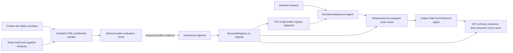

# Rovaulta

## A confidential deployment gate for autonomous warehouse robots

Rovaulta answers one practical question before a robot is released:

> Did this exact robot software build pass this site's private evaluation rules, and has an authorized human approved this exact release?

It combines confidential evaluation with a hardware-gated release path. The factory does not need
to publish its private safety envelope, and the deployment agent cannot approve a release by itself.
The current checkout reaches the Ledger pre-signing boundary; final signing remains subject to the
external Ledger Clear Signing prerequisite documented below.

**Built for ETHGlobal with Chainlink CRE, The Graph, and Ledger as load-bearing integrations.**

> **Current status:** P1–P8 software is implemented and P9–P15 now wire the account-backed lifecycle
> through the partner boundaries: the official CRE CLI simulation path, a real Sepolia registry
> clearance, a live The Graph Subgraph Studio `MATCHED` check, and a real Gemini tool-calling run
> that reaches the existing Ledger-required handoff. The committed artifacts distinguish simulation
> from live CRE/DON execution and distinguish Speculos from physical Ledger evidence. Live CRE
> gateway/DON delivery, physical Clear Signing, the required two-to-four-minute Graph/ETHOnline
> demo video, and other final showcase assets remain open and are not
> presented as completed proof. Start Fresh / From Scratch eligibility is documented as a maintainer
> declaration with repository-history corroboration in the [eligibility artifact](docs/compliance/evidence/graph-start-fresh-eligibility-2026-09-11.md).

[Product path](#use-the-product) · [How it works](#how-it-works) · [Partner proof](#partner-integrations) · [Testing](#testing) · [Known limits](#current-status-and-known-limits)

## In one minute

### Who is this for?

- A factory or warehouse safety engineer.
- A robot vendor or systems integrator deploying an autonomous mobile robot (AMR).
- A team that needs to cooperate across company boundaries without sharing every private detail.

### What problem does it solve?

A factory knows sensitive facts about its site: restricted zones, worker-only areas, speed limits,
payload limits, and emergency paths. A robot vendor has proprietary software and models. Both sides
still need evidence that a particular software build can be evaluated against that particular site.

A normal shared database does not solve the trust problem well when the parties do not want to give
each other their private rules or software internals. A generic AI agent also cannot be the final
authority for a high-impact physical action.

### What did we build?

We built Rovaulta for the moment when a robot vendor and a factory need to trust the same result
without sharing everything with each other.

Rovaulta creates a versioned clearance for an exact combination of:

`site + robot + build + safety-envelope commitment + evaluator version + expiry`

The safety result is deterministic. A deployment agent can explain the result and prepare a release,
but the release gate requires a human to approve the exact deployment intent with Ledger hardware
before it can report authorization. The current evidence stops before that signature when the
external Clear Signing prerequisite is unavailable.

### Why it matters

Rovaulta is not a robot controller, a robot marketplace, or a generic wallet agent. It is a
**proof-to-deploy boundary** for autonomous software entering a physical environment.

The first wedge is cross-company warehouse AMR deployment. The same pattern could later support
industrial cobots, forklifts, inspection drones, or other autonomous machines, but this MVP stays
focused on one warehouse story.

## The problem in plain language

Consider a vendor deploying `robot-build:corrected-v1` to `site:demo-warehouse`.

The warehouse may not want to reveal:

- the complete floor geometry;
- human-only and machine-only zones;
- speed and payload thresholds;
- emergency routes; or
- the full set of private test scenarios.

The vendor may not want to reveal model weights, planning logic, or controller internals.

Rovaulta lets the evaluator use those inputs without turning the private envelope into a public
database record. It publishes only the minimum result and exact binding needed for a later release
decision.

Passing a simulation is **not** a claim that a robot is physically safe. It means only that the exact
build passed the specified evaluation envelope. Physical commissioning and operational controls are
still required.

## The solution

Rovaulta has three separate authorities:

1. **Deterministic evaluator** — computes `CLEAR` or `HOLD` from versioned inputs. An LLM cannot
   change the safety verdict.
2. **Public attestation** — records public hashes, bindings, verdict, issuer, and expiry in a small
   Sepolia registry. Private site data does not go onchain.
3. **Human release gate** — prepares the exact EIP-712 deployment intent, then requires the human
   operator's Ledger approval. The backend never receives the hardware key.

Changing the build ID or artifact digest changes the binding. The old clearance cannot be reused.

## How it works



### Step by step

1. The site defines a versioned safety envelope. Its rules, geometry, thresholds, and commitment
   blind are private inputs.
2. The vendor identifies one exact robot build and supplies the behavior needed for the evaluation.
3. The configured Chainlink CRE workflow reads the confidential envelope inside its `handlerInTee`
   callback and calls the deterministic simulation core. The normal API fails closed when a deployed
   gateway, site secret, or completed result transport is missing; it never substitutes a local
   evaluator result.
4. Only a minimal result leaves the confidential boundary. An authorized registrar can attest the
   public binding in the Sepolia registry; the current implementation does not claim automatic
   CRE-to-EVM delivery.
5. For an authenticated account target, the deployment agent queries the public clearance through
   The Graph and then performs the direct P5 registry check before calling the existing
   `ReleaseService.prepare()` authority. It cannot sign, consume, write the registry, or invent a
   clearance.
6. Ledger is intended to display and sign the exact deployment intent on the human operator's device;
   the current checkout reaches this boundary but does not claim a completed signature.
7. The API recovers the signer, checks the exact registry state again, and consumes the nonce once.

## What stays private and what becomes public

| Boundary                 | Data                                                                                 | Rule                                                                                                                   |
| ------------------------ | ------------------------------------------------------------------------------------ | ---------------------------------------------------------------------------------------------------------------------- |
| Confidential evaluation  | Site envelope, blind, private rules, geometry, thresholds, and intermediate evidence | Used inside the CRE confidential callback; never logged or sent to the browser                                         |
| Public evaluation result | Version, verdict, evaluation ID, build/site bindings, and a behavior-input digest    | Minimal result only; it does not reveal the private envelope                                                           |
| Sepolia registry         | Public hashes, exact bindings, `CLEAR`, issuer, timestamps, and revocation state     | No private rules or confidential payloads                                                                              |
| Ledger release           | Full deployment intent, including exact build, clearance, signer, nonce, and expiry  | Human hardware confirmation is required; the current evidence stops before signing and the backend never holds the key |

## Use the product

Open `/` after starting the web and API services. Select **Get started** to create an account or
sign in. The authenticated workspace then guides the operator through `/app/setup`, `/app/builds`,
`/app/evaluate`, `/app/releases`, and `/app/evidence`:

1. Create a site and enter its private safety policy. The policy is encrypted at rest and is opened
   only inside the API evaluation boundary.
2. Register a robot and choose a build mode. `Use Existing Build` keeps the current build-number /
   user-supplied artifact flow. `Build From Source` accepts an HTTPS repository, exact commit,
   runtime, and build command; the optional BuildKit runner independently performs the frozen
   Bun/Node build, records the actual artifact digest and bounded provenance, and only then exposes
   that exact artifact-backed build to evaluation. The declared route remains the deterministic
   simulation input; passing evaluation is not a physical-safety claim.
3. Submit the build to the configured CRE evaluation boundary. Only its public result projection
   reaches the browser; a missing or asynchronous CRE result is shown as an unavailable/pending
   state.
4. Review a `HOLD` or `CLEAR` result, paste the public P4 clearance for that exact evaluation when
   available, then prepare a release through the configured P5 gate.
5. The agent queries the live public The Graph subgraph for the exact clearance digest before the P5
   check. Only `MATCHED` context continues. `LEDGER_APPROVAL_REQUIRED`
   means the exact request is waiting for a human Ledger action; it is
   not authorization. Missing clearance or gate configuration remains `BLOCKED`.

### Optional source-build integrity

The source-build path is opt-in and requires Docker with BuildKit/buildx. It uses a temporary
non-root builder, frozen lockfile installation, no lifecycle scripts, no host mounts or secrets,
resource/time/source-size limits, and a fail-closed dependency network (`--network=none` by default).
Set `ROVAULTA_BUILD_INSTALL_NETWORK=default` only when the dedicated BuildKit daemon is restricted
to approved package registries or a controlled proxy. See the [P18 execution plan](docs/planning/exec-plans/P18-build-integrity-reproducible-build.md)
for the provenance contract, research, and real-runner verification command.

The normal workspace is account-backed. It does not load the P7 A/B/C fixture, create browser-only
records, or treat a visual state as authoritative.

### Development-only deterministic fixture

P6/P7 regression scenarios remain available only when the development flag is explicitly enabled:

```bash
ROVAULTA_ENABLE_DEMO_ROUTES=true bun run --cwd apps/web dev
```

Then open `/dev-fixtures/evaluate`. This route is not linked from the product and is intended for
development/regression tests only; it is denied when `NODE_ENV=production`. It uses the checked-in P2/P7 fixture and may show the unsafe A
(`HOLD`), corrected B (`CLEAR`), and mutated C (`BLOCKED / CLEARANCE_BINDING_MISMATCH`) rehearsal.
It is not account data, a live partner execution, a clearance, or proof of physical robot safety.

## Key features

| Feature                          | What the judge can verify                                                                     | User benefit                                                                                                                     |
| -------------------------------- | --------------------------------------------------------------------------------------------- | -------------------------------------------------------------------------------------------------------------------------------- |
| Deterministic evaluation         | `@rovaulta/simulation-core` has fixed-unit rules and negative/property tests                  | The same inputs produce the same verdict                                                                                         |
| Confidential evaluation boundary | CRE `handlerInTee` consumes the private envelope and returns an allowlisted result            | Parties can verify a rule without publishing the rule                                                                            |
| Exact build binding              | Canonical digests bind site, robot, build, envelope commitment, evaluator, and expiry         | A later software change cannot quietly reuse an old clearance                                                                    |
| Public attestation               | `RovaultaRegistry` stores public hashes and validity/revocation state on Sepolia              | Separate organizations have a shared verification surface                                                                        |
| Bounded deployment agent         | Host-owned tools enforce a fixed order and finite public request grammar                      | AI can orchestrate and explain without receiving release authority                                                               |
| Live registry context            | The Graph indexes public RovaultaRegistry events; account preparation requires an exact match | AI decisions use current public chain context without indexing private site data                                                 |
| Hardware approval                | Ledger DMK, WebHID, EIP-712, signer recovery, and one-time nonce checks                       | A human approval is required for the exact high-impact action; this checkout has pre-signing evidence, not a completed signature |
| Reliable rehearsal               | `demo:setup`, `demo:reset`, `demo:run`, and browser race tests                                | A judge can repeat the demo without stale state                                                                                  |

## Partner integrations

### Why Chainlink, The Graph, and Ledger are necessary

These partners answer different questions:

| Partner       | Question                                                                      | Actual use in Rovaulta                                                                                                                                                                                                                                        | Current proof                                                                                                                                                                                                                                               |
| ------------- | ----------------------------------------------------------------------------- | ------------------------------------------------------------------------------------------------------------------------------------------------------------------------------------------------------------------------------------------------------------- | ----------------------------------------------------------------------------------------------------------------------------------------------------------------------------------------------------------------------------------------------------------- |
| Chainlink CRE | Can the site evaluate an exact build without exposing its private envelope?   | The confidential workflow fetches a site-bound secret inside `handlerInTee`, invokes the deterministic evaluator, and releases only the minimal result. The account API uses the official gateway boundary or the explicit authenticated CLI simulation mode. | Current-source authenticated CLI simulation records unsafe `HOLD`, corrected `CLEAR`, and tampered commitment `REJECT`; one account-owned simulated `CLEAR` is persisted with explicit simulation provenance. Live gateway completion remains unconfigured. |
| The Graph     | Can the agent use current public registry context before preparing a release? | A pinned, buildable Sepolia subgraph indexes public `RovaultaRegistry` events. The account-backed agent requires an exact live `MATCHED` Graph context before P5.                                                                                             | Real clearance is indexed, the Studio provider returns `MATCHED`, and the live Gemini run consumes that context before `prepareDeploymentIntent`; Gateway publication is not claimed. Start Fresh eligibility is documented separately.                     |
| Ledger        | Who can authorize the exact release after it passes?                          | The browser uses Ledger DMK, WebHID or test-only Speculos, the Ethereum signer kit, and full EIP-712 intent checks. The agent stops at `LEDGER_APPROVAL_REQUIRED`.                                                                                            | Software and partial Speculos evidence are recorded. Physical Clear Signing and official Tester cases remain blocked by missing external access.                                                                                                            |

### Current bounty status

| Target                                                    | Status                                                                                             | Honest qualification boundary                                                                                                                                                                                                                                                                                                                                                                 |
| --------------------------------------------------------- | -------------------------------------------------------------------------------------------------- | --------------------------------------------------------------------------------------------------------------------------------------------------------------------------------------------------------------------------------------------------------------------------------------------------------------------------------------------------------------------------------------------- |
| Chainlink — Best Confidential Workflow                    | **PASS** for the accepted authenticated CRE simulation path                                        | Official CRE CLI evidence proves confidential `HOLD`, `CLEAR`, and pre-evaluation tampered-commitment `REJECT`; live CRE/DON execution is not claimed.                                                                                                                                                                                                                                        |
| The Graph — Best AI Tooling or AI Use Case with The Graph | **PASS** for implementation; **PARTIAL** for final submission until the required video is attached | A real Sepolia clearance is indexed by the hosted Subgraph Studio deployment, the strict reader returns `MATCHED`, and the real Gemini agent consumes that context. Start Fresh eligibility is supported by the maintainer declaration and repository chronology; Gateway publication is not claimed, and the required two-to-four-minute demo video remains an external submission artifact. |
| Ledger — AI Agents x Ledger                               | **PARTIAL**                                                                                        | The human-in-the-loop boundary, exact intent checks, DMK/WebHID/Speculos integration, and AI refusal to sign are implemented. A completed Ledger signature and authorization readback remain unavailable because the partner-issued origin/accepted-descriptor prerequisite is not configured.                                                                                                |

Without Chainlink's confidential execution, the site would need to hand its private rules to the
party running the evaluator. Without The Graph, the agent would have no indexed public registry
context to inform its account-backed preparation. Without Ledger, the deployment agent could prepare
a release but there would be no hardware trust boundary for the final human decision.

The checked-in demo envelope and traces are synthetic, source-visible test data. The current P3
evidence proves the confidential code path and public-output redaction; it does not claim production
secret custody or a remote robot attestation.

## What is implemented now

| Phase | Implemented scope                                                                                                          | Status                                                                                                             |
| ----- | -------------------------------------------------------------------------------------------------------------------------- | ------------------------------------------------------------------------------------------------------------------ |
| P1    | Canonical identifiers, schemas, serialization, digests, validation, and binding failures                                   | Complete and tested                                                                                                |
| P2    | Seeded warehouse model, restricted-zone/speed/payload rules, deterministic evaluator, and negative/property tests          | Complete locally                                                                                                   |
| P3    | CRE workflow, confidential handler, minimal public result, and redacted authenticated simulations                          | Implemented; live DON deployment not claimed                                                                       |
| P4    | Exact-binding Solidity registry, fuzz/invariant tests, and Sepolia deployment/source verification                          | Implemented; registrar attestation remains explicit and manual                                                     |
| P5    | EIP-712 intent, exact registry checks, durable nonce, Ledger DMK/WebHID/Speculos adapter, and fail-closed signing boundary | Software implemented; hardware evidence incomplete                                                                 |
| P5.2  | Strict Gemini function-calling adapter, host-owned tool state machine, catalog resolution, and Ledger-required handoff     | Live account/Graph run reaches `LEDGER_APPROVAL_REQUIRED`; physical approval remains incomplete                    |
| P9    | CRE application boundary, The Graph public-context adapter/subgraph, and account-backed agent preparation                  | Chainlink simulation, live Studio `MATCHED`, and real Gemini handoff captured; Gateway/Ledger hardware remain open |
| P6    | Judge dashboard and deterministic React Three Fiber digital twin                                                           | Implemented and browser-tested                                                                                     |
| P7    | Fixed-clock offline A/B/C rehearsal, demo reset, stale-response protection, and Playwright flow                            | Implemented and locally rehearsed                                                                                  |
| UI    | Landing, first-time onboarding, workspace navigation, setup/build/evaluate/release/evidence views, and Ledger handoff UX   | Implemented and browser-smoke-tested                                                                               |

## Technology and architecture

| Area                    | Technology                                                                                            | Why it is here                                                                                                                |
| ----------------------- | ----------------------------------------------------------------------------------------------------- | ----------------------------------------------------------------------------------------------------------------------------- |
| Runtime                 | Bun 1.4.x, TypeScript, Turborepo                                                                      | One monorepo workflow for the apps, packages, and partner integrations                                                        |
| Judge UI                | Next.js 16, React 19, React Three Fiber, Three.js                                                     | Shows the public evaluation projection and warehouse scene without receiving private inputs                                   |
| API                     | Fastify 5                                                                                             | Hosts the release boundary and the narrow deployment-agent orchestration                                                      |
| Domain                  | Dependency-light TypeScript                                                                           | Keeps identifiers, schemas, canonical bytes, and digests independent of web or partner code                                   |
| Evaluator               | `@rovaulta/simulation-core`                                                                           | Pure deterministic rules that can run locally and inside the CRE callback                                                     |
| Confidential compute    | Chainlink CRE TypeScript SDK                                                                          | Provides the confidential workflow boundary for private envelope inputs                                                       |
| Attestation             | Solidity, Foundry, viem, Ethereum Sepolia                                                             | Stores public exact bindings without storing private facility data                                                            |
| Human approval          | Ledger DMK, WebHID, Speculos test transport, Ethereum Signer Kit, EIP-712                             | Keeps the release key on the device and makes the signed intent explicit                                                      |
| Public registry context | The Graph Subgraph Studio deployment + Sepolia RovaultaRegistry subgraph (Gateway-compatible adapter) | Gives the bounded agent current public clearance context before the final P5 check; current live proof is Studio, not Gateway |
| Persistence             | Bun SQLite with WAL and atomic nonce consumption                                                      | Provides a single-node replay boundary for the release service                                                                |
| Quality                 | Biome, Bun test, Playwright, Foundry, GitHub Actions                                                  | Covers formatting, unit tests, browser flow, contracts, and scaffold checks                                                   |

### Sepolia registry

The current public registry identity is:

- Contract: [`0xFB270cc222efa8B5005AA097dD512Be2558dde65`](https://sepolia.etherscan.io/address/0xFB270cc222efa8B5005AA097dD512Be2558dde65)
- Chain ID: `11155111`
- Deployment record: [`contracts/deployments/sepolia.json`](contracts/deployments/sepolia.json)
- Contract details and deployment commands: [`contracts/README.md`](contracts/README.md)

The contract does not contain private envelope data, parse canonical JSON, prove that CRE ran, or
authorize a deployment by itself.

## Local Setup & Development Guide

This guide covers everything required to set up, build, and run Rovaulta locally on **any machine** (Linux, macOS, or Windows via WSL2). Following these instructions guarantees complete reproducibility across environments.

---

### 1. System Requirements & Architecture

- **Operating System:** Linux (Ubuntu 22.04 / 24.04 LTS recommended), macOS 13+ (Ventura / Sonoma / Sequoia), or Windows 10 / 11 running **WSL2** (Ubuntu 22.04 / 24.04).
- **Hardware:** 64-bit x86_64 or ARM64 processor, 8 GB+ RAM, 10 GB+ free disk space.
- **Network:** Outbound HTTPS access to Ethereum Sepolia RPC endpoints, Google AI Studio, The Graph Subgraph Studio, and Chainlink CRE Developer APIs.

---

### 2. Install Required System Toolchain

Before installing repository packages, ensure all required base compilers, runtimes, and simulators are installed on your host machine.

#### Step 2.1: System Packages & Compilers

- **On Ubuntu / Debian / WSL2:**

  ```bash
  sudo apt update && sudo apt install -y \
    curl \
    git \
    build-essential \
    sqlite3 \
    python3 \
    python3-venv \
    python3-pip \
    qemu-user-static \
    libjpeg-dev \
    zlib1g-dev \
    libvncserver-dev
  ```

- **On macOS (using Homebrew):**
  ```bash
  brew update && brew install \
    curl \
    git \
    sqlite \
    node \
    python@3.12
  ```

#### Step 2.2: Bun Runtime (Primary Engine)

Rovaulta uses [Bun](https://bun.sh/) (`>=1.2.21`, tested on `1.4.x`) as its primary runtime, monorepo manager, and test runner:

```bash
curl -fsSL https://bun.sh/install | bash

# Reload your shell profile:
source ~/.bashrc   # or source ~/.zshrc

# Verify installation:
bun --version
```

#### Step 2.3: Node.js (Tooling & Subgraph Codegen)

Node.js `v20+` or `v22+` is required for The Graph CLI codegen and Playwright test execution:

```bash
# Ubuntu / Debian / WSL2:
curl -fsSL https://deb.nodesource.com/setup_22.x | sudo -E bash -
sudo apt install -y nodejs

# Verify installation:
node --version
npm --version
```

#### Step 2.4: Foundry (Smart Contract Toolchain)

[Foundry](https://getfoundry.sh/) is required to compile and test the `RovaultaRegistry` Solidity contracts:

```bash
curl -L https://foundry.paradigm.xyz | bash
foundryup

# Verify installation:
forge --version
cast --version
```

#### Step 2.5: Chainlink CRE CLI (Confidential Runtime)

The official Chainlink CRE CLI is required for running local authenticated confidential simulation passes:

```bash
# Install the CRE CLI:
curl -sSf https://raw.githubusercontent.com/smartcontractkit/cre-cli/main/install.sh | bash

# Ensure CRE is in your PATH:
export PATH="$HOME/.cre/bin:$PATH"
echo 'export PATH="$HOME/.cre/bin:$PATH"' >> ~/.bashrc

# Verify installation:
cre version    # Verified on v1.33.0

# Authenticate with your Chainlink Developer credentials:
cre login
cre whoami     # Must display active organization and deploy access
```

#### Step 2.6: Ledger Speculos Simulator (Hardware Approval Gate)

[Speculos](https://github.com/LedgerHQ/speculos) provides the official software emulation of Ledger hardware (Nano S Plus) over loopback HTTP and APDU ports, allowing full validation of the hardware Clear Signing gate without requiring a physical USB Ledger device:

```bash
# 1. Create a dedicated Python virtual environment for Speculos
python3 -m venv ~/rovaulta-speculos-venv
~/rovaulta-speculos-venv/bin/pip install --upgrade pip
~/rovaulta-speculos-venv/bin/pip install speculos

# 2. Set up the official Ledger Nano S Plus Ethereum application ELF binary
mkdir -p ~/rovaulta-speculos
# Place the app-1.22.3-nanos2.elf binary in ~/rovaulta-speculos/
# (The Nano S Plus Ethereum application v1.22.3 is pre-built from Ledger's official app repository)

# 3. Test running Speculos in headless mode:
~/rovaulta-speculos-venv/bin/speculos \
  --model nanosp \
  --display headless \
  --api-port 5000 \
  --apdu-port 9999 \
  ~/rovaulta-speculos/app-1.22.3-nanos2.elf
```

_(Speculos exposes its HTTP REST controller on `http://127.0.0.1:5000` and APDU bridge on port `9999`)._

---

### 3. Clone & Build Rovaulta

```bash
git clone https://github.com/your-org/rovaulta.git ~/rovaulta-wsl
cd ~/rovaulta-wsl

# 1. Install all monorepo dependencies
bun install --frozen-lockfile

# 2. Compile smart contracts
bun run contracts:build

# 3. Verify workspace scaffold and directory integrity
bun run verify:scaffold
```

---

### 4. Environment Configuration

Rovaulta uses a root `.env` file for backend/contract services and an `apps/web/.env.local` file for the Next.js frontend.

#### Step 4.1: Root Environment (`.env`)

Copy the template:

```bash
cp .env.example .env
```

Ensure the following variables are configured in `.env`:

| Variable                             | Recommended Value / Notes                                                    |
| ------------------------------------ | ---------------------------------------------------------------------------- |
| `NODE_ENV`                           | `development`                                                                |
| `WEB_ORIGIN`                         | `http://localhost:3000`                                                      |
| `API_ORIGIN`                         | `http://localhost:4000`                                                      |
| `NEXT_PUBLIC_API_ORIGIN`             | `http://localhost:4000`                                                      |
| `ROVAULTA_APP_DB_PATH`               | `.data/rovaulta-app.sqlite`                                                  |
| `ROVAULTA_RELEASE_DB_PATH`           | `.data/rovaulta-release.sqlite`                                              |
| `EVM_CHAIN_ID`                       | `11155111` (Ethereum Sepolia)                                                |
| `SEPOLIA_RPC_URL`                    | Your Sepolia RPC URL (Alchemy / Infura / QuickNode)                          |
| `SEPOLIA_DEPLOYER_PRIVATE_KEY`       | 32-byte hex private key (funded with testnet Sepolia ETH)                    |
| `ROVAULTA_AUTHORIZED_SIGNERS`        | `0xDad77910DbDFdE764fC21FCD4E74D71bBACA6D8D,<YOUR_DEPLOYER_ADDRESS>`         |
| `GEMINI_API_KEY`                     | Google AI Studio API key                                                     |
| `GEMINI_MODEL`                       | `gemini-3.5-flash-lite` (essential for high RPM and strict function-calling) |
| `THE_GRAPH_STUDIO_QUERY_URL`         | `https://api.studio.thegraph.com/query/1758964/rovaulta-registry/0.1.0`      |
| `NEXT_PUBLIC_LEDGER_DERIVATION_PATH` | `"44'/60'/0'/0/0"` _(MUST be quoted in double quotes)_                       |

#### Step 4.2: Web Application Environment (`apps/web/.env.local`)

To ensure Next.js communicates with the local Speculos emulator instead of opening Chrome WebHID popups:

```bash
cat << 'EOF' > apps/web/.env.local
NEXT_PUBLIC_LEDGER_TRANSPORT=speculos
NEXT_PUBLIC_LEDGER_SPECULOS_URL=http://127.0.0.1:5000
NEXT_PUBLIC_LEDGER_ORIGIN_TOKEN=
NEXT_PUBLIC_LEDGER_DERIVATION_PATH="44'/60'/0'/0/0"
NEXT_PUBLIC_API_ORIGIN=http://localhost:4000
EOF
```

#### Step 4.3: Database Storage & Symlinks

To ensure scripts running from subdirectories share the exact same database as the main API server:

```bash
mkdir -p .data
rm -rf apps/api/.data
ln -s ../../.data apps/api/.data
```

---

### 5. Running the Application

Rovaulta operates as a coordinated 4-process architecture during development and live demonstration.

#### Terminal 1: Ledger Speculos Simulator

```bash
cd ~/rovaulta-wsl
/home/ian/rovaulta-speculos-venv/bin/speculos \
  --model nanosp \
  --display headless \
  --api-port 5000 \
  --apdu-port 9999 \
  /home/ian/rovaulta-speculos/app-1.22.3-nanos2.elf
```

#### Terminal 2: Rovaulta Fastify API Server (Port 4000)

```bash
cd ~/rovaulta-wsl
set -a
source .env
set +a
export ROVAULTA_CRE_EXECUTION_MODE=simulation
export ROVAULTA_CRE_CLI=cre
export ROVAULTA_CRE_TARGET=staging-settings

bun --env-file .env apps/api/src/index.ts
```

_Health check:_ `curl -s http://localhost:4000/health` should return `{"status":"ok"}`.

#### Terminal 3: Rovaulta Next.js Web UI (Port 3000)

```bash
cd ~/rovaulta-wsl
bun run --cwd apps/web dev
```

_Access UI at:_ <http://localhost:3000>

#### Terminal 4: Operator Command Line

Keep this terminal ready for running evidence commands, evaluation passes, and on-chain registry transactions.

---

### 6. End-to-End Live Workflow Commands

Here is the exact command sequence to execute a complete, fresh end-to-end evaluation, on-chain attestation, The Graph query, and Ledger release gate:

#### 6.1: Clean-Slate Reset (Optional)

To wipe test databases and start with completely fresh accounts:

```bash
cd ~/rovaulta-wsl
rm -f .data/rovaulta-app.sqlite* .data/rovaulta-release.sqlite* .data/clearance-*.json .data/p13-setup.json
bun run --cwd apps/api p13:setup-template
```

#### 6.2: Run Confidential Evaluation (Chainlink CRE Simulation)

```bash
export PATH="$HOME/.cre/bin:$PATH"

ROVAULTA_P13_EMAIL="operator@warehouse.io" \
ROVAULTA_P13_PASSWORD="Password12345!" \
ROVAULTA_CRE_EXECUTION_MODE="simulation" \
ROVAULTA_P13_SETUP_PATH=".data/p13-setup.json" \
bun run --cwd apps/api p13:account-evaluation
```

_Returns `status: "CLEAR"`, creating the site, robot, build, and confidential evaluation record._

#### 6.3: Record Clearance On-Chain to Sepolia

Extract the fresh IDs dynamically and write the attestation to the RovaultaRegistry contract:

```bash
NEW_ACCOUNT_ID=$(sqlite3 .data/rovaulta-app.sqlite "SELECT account_id FROM evaluations ORDER BY created_at DESC LIMIT 1;")
NEW_EVAL_ID=$(sqlite3 .data/rovaulta-app.sqlite "SELECT json_extract(public_json, '$.evaluationId') FROM evaluations ORDER BY created_at DESC LIMIT 1;")

export ROVAULTA_CLEARANCE_ACCOUNT_ID="$NEW_ACCOUNT_ID"
export ROVAULTA_CLEARANCE_EVALUATION_ID="$NEW_EVAL_ID"
export ROVAULTA_CLEARANCE_ID="clearance:demo-$(date +%s)"
export ROVAULTA_CLEARANCE_CONFIRM="YES"
export ROVAULTA_CLEARANCE_OUTPUT_PATH=".data/clearance-live.json"

bun --env-file .env apps/api/scripts/record-sepolia-clearance.ts
```

_Outputs transaction hash on Sepolia, block number, and generates both `.data/clearance-live.json` and `.data/clearance-live.digest`._

#### 6.4: Verify with The Graph Subgraph Studio

```bash
export ROVAULTA_P11_CLEARANCE_DIGEST=$(bun apps/api/scripts/get-clearance-digest.ts)
export THE_GRAPH_STUDIO_QUERY_URL='https://api.studio.thegraph.com/query/1758964/rovaulta-registry/0.1.0'

bun run --cwd integrations/the-graph evidence:live
```

_Returns `status: "FOUND"`, proving The Graph indexed the live Sepolia clearance event._

#### 6.5: Run Gemini Deployment-Agent Qualification

```bash
ROVAULTA_P11_ACCOUNT_ID="$NEW_ACCOUNT_ID" \
ROVAULTA_P11_CLEARANCE_PATH=".data/clearance-live.json" \
ROVAULTA_P11_SIGNER_ADDRESS="0xDad77910DbDFdE764fC21FCD4E74D71bBACA6D8D" \
bun run --cwd apps/api evidence:p11-graph
```

_Executes all 7 qualification tool-calls and halts at `LEDGER_APPROVAL_REQUIRED`._

#### 6.6: Human Ledger Hardware Gate in the Browser

1. Open <http://localhost:3000/start> and sign in (`operator@warehouse.io` / `Password12345!`).
2. Navigate to **Releases** (`/app/releases`).
3. Under **Authorized signer address**, enter `0xDad77910DbDFdE764fC21FCD4E74D71bBACA6D8D`.
4. Paste the exact contents of `.data/clearance-live.json` into **Public P4 clearance record**.
5. Click **Prepare release →** (Gemini prepares the EIP-712 payload).
6. Click **Continue to human Ledger approval →** (navigates to `/p5-ledger`).
7. Click **Connect Ledger** (connects loopback Speculos emulator).
8. Click **Sign deployment intent** (truthfully halts at `CLEAR_SIGNING_UNAVAILABLE`, refusing to blind-sign).

---

### 7. Alternative: Fast Offline Deterministic Rehearsal

If you are developing offline without internet access or live API keys, you can run the self-contained deterministic rehearsal path:

```bash
bun run demo:setup       # Creates isolated .data/rovaulta-demo fixture
ROVAULTA_ENABLE_DEMO_ROUTES=true bun run dev
```

In another terminal:

```bash
bun run demo:run         # Runs deterministic A/B/C safety trace
bun run demo:rehearse    # Runs Playwright browser test against the digital twin
bun run demo:reset       # Safely clears demo fixture directory
```

---

### 8. Common Pitfalls & Troubleshooting

- **`The public clearance does not match this exact evaluation`**:
  Ensure you query `json_extract(public_json, '$.evaluationId')` from SQLite instead of using the raw database row ID (`evaluation-record:<hex>`). The row ID is an internal storage key, while the evaluation ID is the canonical domain identifier bound to the clearance.
- **`bash: .env: line XX: unexpected EOF while looking for matching ''`**:
  In your `.env` file, ensure `NEXT_PUBLIC_LEDGER_DERIVATION_PATH="44'/60'/0'/0/0"` is wrapped in double quotes to prevent bash from treating single quotes as unterminated string literals during `source .env`.
- **Chrome WebHID Popup appears**:
  Ensure `apps/web/.env.local` contains `NEXT_PUBLIC_LEDGER_TRANSPORT=speculos`. Next.js does not inherit client-side variables from the root `.env` unless declared in `apps/web/.env.local`.
- **`ROVAULTA_P11_CLEARANCE_DIGEST must be a 32-byte public clearance digest`**:
  Use `bun apps/api/scripts/get-clearance-digest.ts` or read `.data/clearance-live.digest`. The 32-byte digest is computed cryptographically from the record fields and is not a plain string in `clearance-live.json`.
- **`ApplicationError: Evaluation was not found`**:
  Ensure `apps/api/.data` is a symlink to `../../.data` (`ln -s ../../.data apps/api/.data`). Otherwise, commands executed with `--cwd apps/api` will look in an empty child database.

## Testing

Run the focused checks first:

```bash
bun run lint
bun run typecheck
bun run test
bun run contracts:test
bun run demo:setup
bun run demo:run
bun run demo:rehearse
```

Run the repository gate before a merge:

```bash
bun run build
bun run verify:scaffold
bun run verify
```

The current verification report records TypeScript tests across the domain, evaluator, Chainlink,
API, chain-client, Ledger, and web packages, plus contract fuzz/invariant coverage and eleven browser
tests covering the normal account lifecycle and the isolated P6/P7 fixture. See
[`VERIFICATION_REPORT.md`](VERIFICATION_REPORT.md) for the exact boundary and current evidence.

Partner-specific checks are documented here:

- [Chainlink CRE integration](integrations/chainlink-cre/README.md)
- [Ledger integration](docs/partners/LEDGER.md)
- [The Graph integration](docs/partners/THE_GRAPH.md)
- [Attestation registry](contracts/README.md)

## Proof and evidence

These artifacts are intentionally separated by trust boundary:

- [P3 authenticated CRE simulation](docs/compliance/evidence/chainlink-cre-p3-authenticated-simulation-2026-09-06.md)
  — historical unsafe `HOLD`, corrected `CLEAR`, tampered commitment `REJECT`; simulation only.
- [P4 Sepolia deployment](docs/compliance/evidence/p4-sepolia-deployment-2026-09-06.md)
  — public registry identity and source verification.
- [P5 software evidence](docs/compliance/evidence/p5-ledger-release-gate-software-2026-09-06.md)
  — exact intent, registry checks, signer policy, nonce, and replay boundaries.
- [P5 Speculos partial evidence](docs/compliance/evidence/p5-ledger-speculos-partial-2026-09-07.md)
  — emulator transport/app/address smoke and pre-sign denials; not physical hardware proof.
- [P5 Speculos browser-boundary evidence](docs/compliance/evidence/p5-ledger-speculos-browser-boundary-2026-09-11.md)
  — clean emulator restart, authenticated exact-intent preparation, public mutation rejection,
  and the fail-closed origin-token/descriptor boundary; no signature or physical-device claim.
- [P5.2 agent evidence](docs/compliance/evidence/p5.2-ai-deployment-agent-2026-09-07.md)
  — bounded orchestration and Ledger-required handoff.
- [P7 deterministic rehearsal](docs/compliance/evidence/p7-deterministic-demo-2026-09-07.md)
  — repeatable public A/B/C trace and reset/race coverage.
- [The Graph integration contract](docs/partners/THE_GRAPH.md)
  — public registry subgraph design, pinned build/deploy path, load-bearing agent context, and
  live-evidence boundary.
- [P11 The Graph evidence](docs/compliance/evidence/p11-the-graph-qualification-2026-09-09.md)
  — local build/test proof, operator commands, and explicit live-evidence blockers.
- [P14 live Sepolia and Graph evidence](docs/compliance/evidence/p14-live-bounty-evidence-2026-09-09.md)
  — the account-owned simulated `CLEAR`, confirmed Sepolia registry events, and live Subgraph
  Studio `MATCHED` response.
- [P19 current CRE simulation evidence](docs/compliance/evidence/chainlink-cre-p19-authenticated-simulation-2026-09-12.md)
  — fresh authenticated CRE CLI v1.33.0 `HOLD`/`CLEAR`/tampered `REJECT` results with public-only
  output and no live-DON claim.
- [P15 live Gemini agent evidence](docs/compliance/evidence/p15-live-gemini-graph-ledger-boundary-2026-09-10.md)
  — real Gemini tool calls over the live Graph context, `prepareDeploymentIntent`, and the
  `LEDGER_APPROVAL_REQUIRED` pre-signing boundary; no physical-device claim.
- [Evidence matrix](docs/compliance/EVIDENCE_MATRIX.md) — judge-facing map of claims to artifacts.

### Existing Ledger emulator screenshots

These images show public-address confirmation in the Speculos development emulator. They are not
physical Ledger-device evidence.

| Address review                                                                                 | Address confirmation                                                                                  |
| ---------------------------------------------------------------------------------------------- | ----------------------------------------------------------------------------------------------------- |
|  |  |

The current Ledger blocker is explicit:

> Signing pending Ledger partner origin token — external prerequisite, not a code gap. Ledger support confirmed Speculos acceptable as hardware substitute.

Speculos transport, the official Ethereum app, address review, and the exact pre-signing checks are
real and testable. They do not by themselves prove a Clear Signing signature or `AUTHORIZED`
readback. This repository uses the human-in-the-loop Ledger direction; `wallet-cli ring`, Key Ring,
Ledger-secured payments, and VPS secret brokerage are not present or claimed.

## Project structure

```text
apps/web/                  Next.js landing page, product workspace, evaluator, evidence views, and /p5-ledger harness
apps/api/                  Fastify release boundary and bounded deployment agent
packages/domain/           Canonical identifiers, schemas, serialization, and digests
packages/simulation-core/  Pure deterministic warehouse evaluator
packages/chain-client/     Sepolia registry reads and EIP-712 verification
packages/ledger-gate/      Browser Ledger DMK/WebHID/Speculos boundary
integrations/chainlink-cre CRE workflow and confidential handler
contracts/                 Foundry RovaultaRegistry and deployment artifacts
scripts/                   Demo rehearsal and scaffold verification commands
docs/                      Planning, architecture, partner, compliance, and AI-use records
tests/e2e/                 P6/P7 regression flows plus the P8 landing/onboarding smoke path
```

The main architecture references are [`docs/architecture/OVERVIEW.md`](docs/architecture/OVERVIEW.md),
[`docs/architecture/TRUST_BOUNDARIES.md`](docs/architecture/TRUST_BOUNDARIES.md), and
[`docs/architecture/DATA_FLOW.md`](docs/architecture/DATA_FLOW.md).

## Current status and known limits

This is a production-minded hackathon MVP, not a claim of production robot safety.

Implemented and locally verified:

- deterministic domain and evaluator protocol;
- confidential handler path and redacted CRE simulation evidence;
- exact-binding Sepolia registry and read policy;
- Ledger release-intent software boundary and replay protection;
- bounded deployment-agent orchestration;
- account-backed CRE/Graph partner boundaries with fail-closed provider handling;
- product landing, onboarding, workspace navigation, digital twin, reset flow, and deterministic
  rehearsal.

Not yet proven or intentionally not implemented:

- a live Chainlink DON/Vault/Nitro deployment or automatic CRE-to-EVM attestation (not required for the selected simulation qualification path);
- a completed account-created CRE gateway result (the deployed gateway is asynchronous and no result
  transport is configured in this checkout);
- a live Graph Gateway `MATCHED` response or decentralized-network publication; the hosted Sepolia
  Subgraph Studio deployment and exact `MATCHED` response are captured in the P14 evidence artifact;
- Gemini 2.5 Flash for this specific AI Studio key (the live evidence uses the explicit
  `gemini-3.5-flash` override because 2.5 is unavailable to new users);
- official Ledger Clear Signing Tester A/B/E/F access and complete Speculos signing captures;
- physical Ledger approval evidence;
- a completed Ledger signature/`ReleaseAuthorization` readback. The current `/p5-ledger` flow stops
  at `CLEAR_SIGNING_UNAVAILABLE` when the partner-issued origin token or accepted descriptor is absent;
  the local ERC-7730 file is a candidate descriptor, not proof of Ledger registry acceptance;
- `wallet-cli ring`, Key Ring, a scoped-secret broker, or a Ledger-secured payment flow (these are
  separate bounty directions and are intentionally outside Rovaulta's human approval gate);
- proof that a remote black-box model endpoint is the exact artifact whose digest was evaluated;
- physical robot commissioning, robot control loops, or automatic robot activation;
- the required two-to-four-minute public demo video for The Graph/ETHOnline, plus any other final
  showcase assets.

These are limitations, not hidden fallback behavior. The software fails closed when a required
authority, provider, descriptor, or binding is missing.

## Future improvements

The next work should stay narrow:

1. Capture legitimate Ledger origin/descriptor and physical-device evidence.
2. Repeat the Gemini run with the repository-default `gemini-2.5-flash` when Google AI Studio makes
   that model available to this key; the live evidence currently uses the explicit `gemini-3.5-flash`
   override.
3. Provision request-scoped CRE secrets, deploy the workflow/result transport, and document the real
   DON/Vault boundaries.
4. Publish the Rovaulta Sepolia subgraph through a Graph Gateway and capture a decentralized
   provider-backed account trace (Studio evidence is already captured).
5. Add stronger remote artifact or inference-endpoint attestation before treating a model service as
   the evaluated build.
6. Add physical commissioning evidence and the final P8 submission materials.

Do not turn the browser projection into an authority, add robot activation, or store private site
rules onchain as part of these improvements.

## Team, credits, and license

Rovaulta is submitted as an ETHGlobal From Scratch project, supported by the maintainer-origin
declaration and repository chronology in [`graph-start-fresh-eligibility-2026-09-11.md`](docs/compliance/evidence/graph-start-fresh-eligibility-2026-09-11.md).
The repository records its AI-assisted development and evidence process in [`docs/ai/AI_USAGE.md`](docs/ai/AI_USAGE.md). Chainlink CRE and
Ledger are used through their documented SDKs and hardware/application boundaries; their names and
marks remain the property of their respective owners.

No `LICENSE` file is currently committed. Add the intended license before publishing a reusable
library or accepting external contributions.
